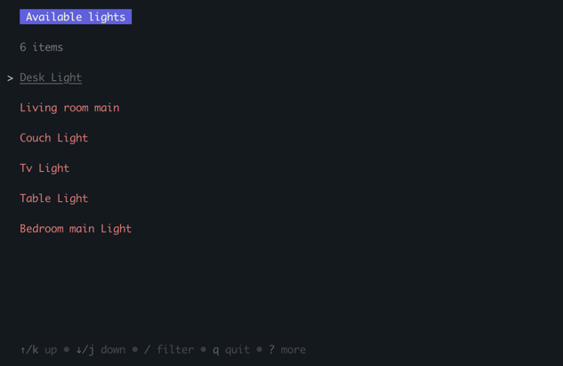

# About

Ever got bothered by the amount of clicks you'd have to do to turn on / off your lights. Don't want to bother grabbing your phone or remote to control your lights?
No worries! `go-assistant` is your friendly command-line sidekick, to control your home-assistant lights like a pro.

# Installation
TODO

# Initialization & Configuration
Before you get started make sure to run `go-assistant init` to set up the configuration files for your system. This will basically create a `config.json` in the users configuration directory.
Running `go-assistant configure` will open the `config.json` through `nano` where you're able to configure the home-assistant endpoint and long-lived token.

# How to use it
- Accept your laziness by opening your terminal.
- Use the command `go-assistant lights` to toggle your lights on or off or tab into the brightness control panel.
- Apply
- Profit.