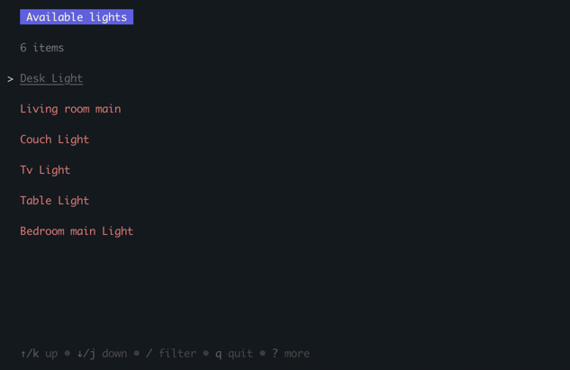
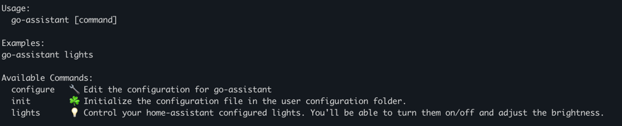

# About

Ever got bothered by the amount of clicks you'd have to do to turn on / off your lights. Don't want to bother grabbing your phone or remote to control your lights?
No worries! `go-assistant` is your friendly command-line sidekick, to control your home-assistant lights like a pro.



## Supported actions

- Toggle lights on / off
- Adjust brightness
- Adjust color temperature (if supported by the light)

# Installation

```
go install github.com/DarylvdBerg/go-assistant@v1.0.0
```

# Initialization & Configuration

To initialize the configuration for this tool, run:
```
go-assistant init
```
This will create a `config.json` file in your user configuration directory in a new folder called `go-assistant`.

To configure go-assistant, run:
```
go-assistant configure
```
This will open a `nano` editor (for Linux / MacOS) with the `config.json` file where you can set your Home Assistant endpoint and long-lived access token.

# Usage



- Accept your laziness by opening your terminal.
- Use the command `go-assistant lights` to toggle your lights on or off or tab into the brightness control panel.
- Apply
- Profit.